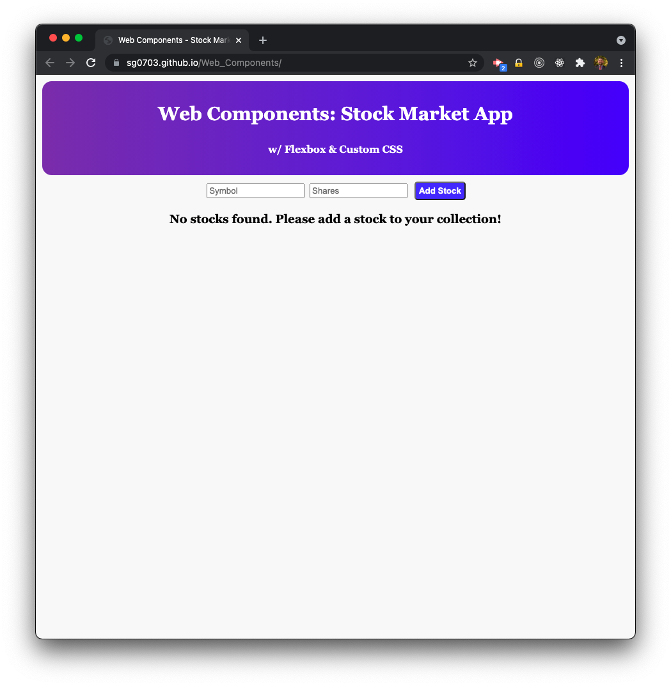

# Web Components - Stock Market App

## Description

Update 7-28-21! The app now fetches live stock quotes from [FinnHub.io](https://finnhub.io/docs/api) for each stock entered. You no longer have to manually enter the current price. Your stocks are also now saved. So you can navigate away from the site and the cards are there when you come back. When you delete a card, it is removed from your saved stocks.

I created this app to learn web components, practice with CSS flexbox, and practice my CSS styling. I had a lot of fun and learned a ton about Web Components! Deployed on [GitHub pages](https://sg0703.github.io/Web_Components/).

## Table of Contents

- [Installation](#installation)
- [Usage](#usage)
- [Future Features](#future-features)
- [License](#license)
- [Questions](#questions)

## Installation

Clone the repo or just download the files, it's only HTML, CSS, and vanilla JavaScript!

## Usage

The app is deployed on [GitHub pages](https://sg0703.github.io/Web_Components/). If you download the code, a sample dataset is included. Just play around with it - add some stocks, click on the button to show or hide stock data, and click the delete button.

## Future Features

- Refreshing stock data at a given interval
- Updating share count

## License

Copyright (c) Sam Gates. All rights reserved.
Licensed under the [MIT](https://opensource.org/licenses/MIT) license.

## Questions

Check out my [GitHub Profile](https://github.com/sg0703).

Email with questions! You can reach me at sam.j.gates@gmail.com.
